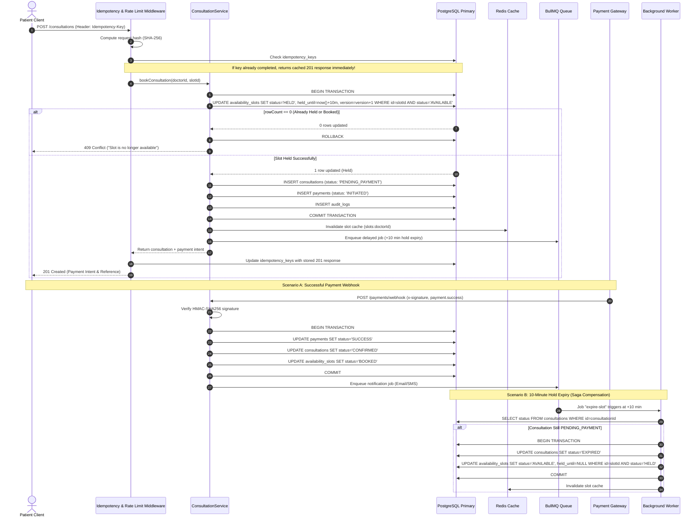

# Booking Flow Sequence Diagram

```mermaid
sequenceDiagram
    autonumber
    actor Patient as Patient Client
    participant MW as Idempotency & Rate Limit Middleware
    participant CS as ConsultationService
    participant DB as PostgreSQL Primary
    participant Cache as Redis Cache
    participant Queue as BullMQ Queue
    participant Gateway as Payment Gateway
    participant Worker as Background Worker

    Patient->>MW: POST /consultations (Header: Idempotency-Key)
    MW->>MW: Compute request hash (SHA-256)
    MW->>DB: Check idempotency_keys
    Note over MW,DB: If key already completed, returns cached 201 response immediately!

    MW->>CS: bookConsultation(doctorId, slotId)
    CS->>DB: BEGIN TRANSACTION
    CS->>DB: UPDATE availability_slots SET status='HELD', held_until=now()+10m, version=version+1 WHERE id=slotId AND status='AVAILABLE'
    alt rowCount == 0 (Already Held or Booked)
        DB-->>CS: 0 rows updated
        CS->>DB: ROLLBACK
        CS-->>Patient: 409 Conflict ("Slot is no longer available")
    else Slot Held Successfully
        DB-->>CS: 1 row updated (Held)
        CS->>DB: INSERT consultations (status: 'PENDING_PAYMENT')
        CS->>DB: INSERT payments (status: 'INITIATED')
        CS->>DB: INSERT audit_logs
        CS->>DB: COMMIT TRANSACTION
        CS->>Cache: Invalidate slot cache (slots:doctorId)
        CS->>Queue: Enqueue delayed job (+10 min hold expiry)
        CS-->>MW: Return consultation + payment intent
        MW->>DB: Update idempotency_keys with stored 201 response
        MW-->>Patient: 201 Created (Payment Intent & Reference)
    end

    Note over Patient,Gateway: Scenario A: Successful Payment Webhook
    Gateway->>CS: POST /payments/webhook (x-signature, payment.success)
    CS->>CS: Verify HMAC-SHA256 signature
    CS->>DB: BEGIN TRANSACTION
    CS->>DB: UPDATE payments SET status='SUCCESS'
    CS->>DB: UPDATE consultations SET status='CONFIRMED'
    CS->>DB: UPDATE availability_slots SET status='BOOKED'
    CS->>DB: COMMIT
    CS->>Queue: Enqueue notification job (Email/SMS)

    Note over Worker,DB: Scenario B: 10-Minute Hold Expiry (Saga Compensation)
    Queue->>Worker: Job "expire-slot" triggers at +10 min
    Worker->>DB: SELECT status FROM consultations WHERE id=consultationId
    alt Consultation Still PENDING_PAYMENT
        Worker->>DB: BEGIN TRANSACTION
        Worker->>DB: UPDATE consultations SET status='EXPIRED'
        Worker->>DB: UPDATE availability_slots SET status='AVAILABLE', held_until=NULL WHERE id=slotId AND status='HELD'
        Worker->>DB: COMMIT
        Worker->>Cache: Invalidate slot cache
    end
```
