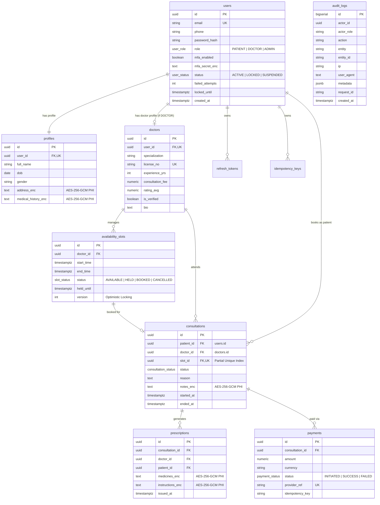

# Entity Relationship Diagram

```mermaid
erDiagram
    users ||--|| profiles : "has profile"
    users ||--o| doctors : "has doctor profile (if DOCTOR)"
    users ||--o{ refresh_tokens : "owns"
    users ||--o{ idempotency_keys : "owns"

    doctors ||--o{ availability_slots : "manages"
    doctors ||--o{ consultations : "attends"
    users ||--o{ consultations : "books as patient"

    availability_slots ||--o| consultations : "booked for"

    consultations ||--o{ prescriptions : "generates"
    consultations ||--o{ payments : "paid via"

    users {
        uuid id PK
        string email UK
        string phone
        string password_hash
        user_role role "PATIENT | DOCTOR | ADMIN"
        boolean mfa_enabled
        text mfa_secret_enc
        user_status status "ACTIVE | LOCKED | SUSPENDED"
        int failed_attempts
        timestamptz locked_until
        timestamptz created_at
    }

    profiles {
        uuid id PK
        uuid user_id FK,UK
        string full_name
        date dob
        string gender
        text address_enc "AES-256-GCM PHI"
        text medical_history_enc "AES-256-GCM PHI"
    }

    doctors {
        uuid id PK
        uuid user_id FK,UK
        string specialization
        string license_no UK
        int experience_yrs
        numeric consultation_fee
        numeric rating_avg
        boolean is_verified
        text bio
    }

    availability_slots {
        uuid id PK
        uuid doctor_id FK
        timestamptz start_time
        timestamptz end_time
        slot_status status "AVAILABLE | HELD | BOOKED | CANCELLED"
        timestamptz held_until
        int version "Optimistic Locking"
    }

    consultations {
        uuid id PK
        uuid patient_id FK "users.id"
        uuid doctor_id FK "doctors.id"
        uuid slot_id FK,UK "Partial Unique Index"
        consultation_status status
        text reason
        text notes_enc "AES-256-GCM PHI"
        timestamptz started_at
        timestamptz ended_at
    }

    prescriptions {
        uuid id PK
        uuid consultation_id FK
        uuid doctor_id FK
        uuid patient_id FK
        text medicines_enc "AES-256-GCM PHI"
        text instructions_enc "AES-256-GCM PHI"
        timestamptz issued_at
    }

    payments {
        uuid id PK
        uuid consultation_id FK
        numeric amount
        string currency
        payment_status status "INITIATED | SUCCESS | FAILED"
        string provider_ref UK
        string idempotency_key
    }

    audit_logs {
        bigserial id PK
        uuid actor_id
        string actor_role
        string action
        string entity
        string entity_id
        string ip
        text user_agent
        jsonb metadata
        string request_id
        timestamptz created_at
    }
```
